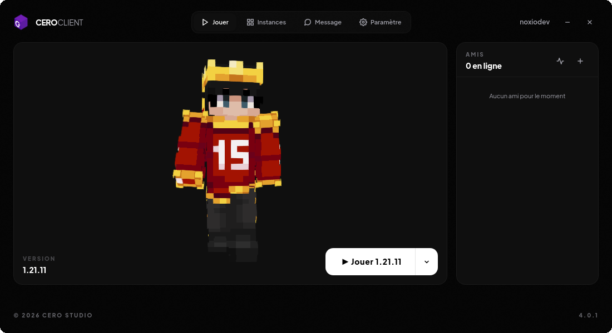

# CeroClient

  CeroClient is a free and open Minecraft client designed to be highly optimized and lightweight.

  

---
### Translations

- [Français](./translation/md/README_fr.md)

## Features & Tasks

- [ ] **Instances**
	- [ ] Install a loader (e.g., Forge, Fabric, etc.)
	- [ ] Save and manage instances
- [x] **Play Minecraft**
	- [x] Download Manifest
	- [x] Read Metadata
	- [x] Download Libs
	- [x] Download Client
	- [x] Download Assets
	- [x] Start Client
	- [ ] Install Fabric
	- [ ] Install Forge
	- [ ] Start Fabric
	- [ ] Start Forge
- [x] **Connect Microsoft Account**
- [x] Create an Installer
- [x] Create an Updater
- [x] Rewrite the Launcher in C/C++
- [ ] Friend & Chat system
    - [x] Send Message
    - [ ] Invite in his world
    - [x] Add Friend
    - [x] Remove Friend
- [ ] Add Android Support
- [ ] Multi Language Support

---

## Installation

All downloads and instructions for CeroClient are available on our [Website](https://cerostudio.fr/ceroclient) (not already updated) or from releases.

*Note: macOS is largely untested — we currently have no macOS testers.*

## Architecture

| Component | Language | Role |
|---|---|---|
| `src/`, `include/` | C / C++ | Native launcher, webview UI, IPC, AES-GCM crypto |
| `agent/` | Java | Mixin service, MCP/ProGuard→Tiny remapper, custom classloader |
| `bootstrapper/` | Rust | Installation and auto-update |
| `server/` | Go | Authentication, friends, WebSocket messaging |
| `assets/` | HTML/CSS/JS | User interface |
| `tools/`, `build.py` | Python | Build pipeline, asset packaging, JS obfuscation |
| `installer/` | Nim / NSIS | Platform installers (Unix-like/WinNT) |

## Building from Source

If you want to compile CeroClient yourself, you can use the provided build scripts in the repository.

*For further assistance with installing prerequisites and compiling, please refer to `BUILDING.md`.*

**Requirements (Linux):**
* **GCC / G++** ≥ `13.3.0`
* **Python** ≥ `3.9` (Tested : 3.13)
* **Rust / Cargo** (Latest stable)
* **pkg-config**
* **Dependencies:** `gtk+-3.0`, `webkit2gtk-4.1`, `libcurl` (and `ayatana-appindicator3-0.1` or `appindicator3-0.1` for system tray support)

**Requirements (Windows):**
* **MinGW-w64** (GCC / G++)
* **Rust / Cargo** (Latest stable)
* Pre-compiled dependencies in `%USERPROFILE%\mingw-deps\x64-windows`

### Instructions

1. Clone the repository.
2. Install all python dependencies: `pip install -r requirements.txt`
3. Run the build script: `python3 build.py`

*Note: On Windows, WebView2 requires additional setup — run `setup_webview.bat` before building.*

### Development

You can run it easily for debugging or to test a modification.

1. Install all python dependencies: `pip install -r requirements.txt`
2. Run the run script: `python3 run.py`

*Note: On Windows, WebView2 requires additional setup — run `setup_webview.bat` before building.*

---
## License

This project is licensed under the GNU General Public License v3.0 only.
See the [LICENSE](./LICENSE) file for details.

CeroClient does not include or distribute Minecraft itself or proprietary assets owned by Mojang or Microsoft. Users are responsible for obtaining and using Minecraft in accordance with Mojang's terms.

Copyright © 2025–2026 Cero Studio.

