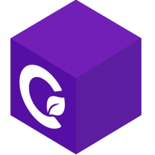

<h1 align="center"> <strong>Cero</strong>Client</h1>

  CeroClient est un client Minecraft gratuit et open source conçu pour être hautement optimisé et léger.

  

  
  
  
  
  
  
  
  
  
  
  
  

---
### Traductions

- [English](../../README.md)

## Fonctionnalités & Tâches

- [ ] **Instances**
    - [ ] Installer un chargeur (ex. : Forge, Fabric, etc.)
    - [ ] Sauvegarder et gérer les instances
- [x] **Jouer à Minecraft**
    - [x] Télécharger le manifeste
    - [x] Lire les métadonnées
    - [x] Télécharger les bibliothèques
    - [x] Télécharger le client
    - [x] Télécharger les assets
    - [x] Démarrer le client
    - [ ] Installer Fabric
    - [ ] Installer Forge
    - [ ] Démarrer Fabric
    - [ ] Démarrer Forge
- [x] **Connexion au compte Microsoft**
- [x] Créer un installateur
- [x] Créer un système de mise à jour (Updater)
- [x] Réécrire le lanceur en C/C++
- [ ] Système d'amis et de chat
    - [x] Envoyer un message
    - [ ] Inviter dans son monde
    - [x] Ajouter un ami
    - [x] Supprimer un ami
- [ ] Ajouter le support d'Android
- [x] Support multilingue

---

## Installation

Tous les téléchargements et instructions pour CeroClient sont disponibles sur notre [Site Web](https://cerostudio.fr/ceroclient) (pas encore à jour) ou depuis les releases.

*Note : macOS est largement non testé — nous n'avons actuellement aucun testeur sur macOS.*

## Architecture

| Composant | Langage | Rôle |
|---|---|---|
| `src/`, `include/` | C / C++ | Lanceur natif, interface webview, IPC, chiffrement AES-GCM |
| `agent/` | Java | Service de mixin, remappeur MCP/ProGuard vers Tiny, classloader personnalisé |
| `bootstrapper/` | Rust | Installation et mise à jour automatique |
| `server/` | Go | Authentification, amis, messagerie WebSocket |
| `server/commands/lua/` | Lua | Commandes serveur extensibles (kick, status, friends...) |
| `assets/` | HTML/CSS/JS | Interface utilisateur |
| `tools/`, `build.py` | Python | Pipeline de build, empaquetage d'assets, obfuscation JS |
| `installer/` | Nim / NSIS | Installateurs de plateformes (type Unix / WinNT) |

## Compilation depuis les sources

Si vous souhaitez compiler CeroClient vous-même, vous pouvez utiliser les scripts de build fournis dans le dépôt.

*Pour plus d'aide sur l'installation des prérequis et la compilation, veuillez consulter `BUILDING.md`.*

**Prérequis (Linux) :**
* **GCC / G++** ≥ `13.3.0`
* **Python** ≥ `3.9` (Testé : 3.13)
* **Rust / Cargo** (Dernière version stable)
* **pkg-config**
* **Dépendances :** `gtk+-3.0`, `webkit2gtk-4.1`, `libcurl` (et `ayatana-appindicator3-0.1` ou `appindicator3-0.1` pour le support de la zone de notification / system tray)

**Prérequis (Windows) :**
* **MinGW-w64** (GCC / G++)
* **Rust / Cargo** (Dernière version stable)
* Dépendances pré-compilées dans `%USERPROFILE%\mingw-deps\x64-windows`

### Instructions

1. Clonez le dépôt.
2. Installez toutes les dépendances Python : `pip install -r requirements.txt`
3. Exécutez le script de build : `python3 build.py`

*Note : Sous Windows, WebView2 nécessite une configuration supplémentaire — exécutez `setup_webview.bat` avant de compiler.*

### Développement

Vous pouvez l'exécuter facilement pour le débogage ou pour tester une modification.

1. Installez toutes les dépendances Python : `pip install -r requirements.txt`
2. Exécutez le script d'exécution : `python3 run.py`

*Note : Sous Windows, WebView2 nécessite une configuration supplémentaire — exécutez `setup_webview.bat` avant de compiler.*

---
## Licence

Ce projet est sous licence GNU General Public License v3.0 uniquement.
Voir le fichier [LICENSE](../../LICENSE) pour plus de détails.

CeroClient n'inclut ni ne distribue Minecraft lui-même ou les actifs propriétaires appartenant à Mojang ou Microsoft. Les utilisateurs sont tenus d'obtenir et d'utiliser Minecraft conformément aux conditions de Mojang.

Copyright © 2025–2026 Cero Studio.